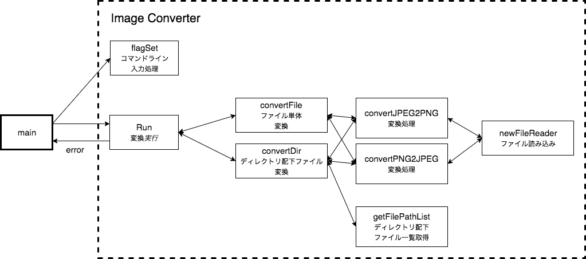

# 課題1【TRY】画像変換コマンドを作ろう

## 課題内容

```
次の仕様を満たすコマンドを作って下さい
ディレクトリを指定する
指定したディレクトリ以下のJPGファイルをPNGに変換（デフォルト）
ディレクトリ以下は再帰的に処理する
変換前と変換後の画像形式を指定できる（オプション）
以下を満たすように開発してください
mainパッケージと分離する
自作パッケージと標準パッケージと準標準パッケージのみ使う
準標準パッケージ：golang.org/x以下のパッケージ
ユーザ定義型を作ってみる
GoDocを生成してみる
```

## Usage

### ビルド  
`go build -o imgconv`

### 実行  
`./imgconv [-src] [-to] [-mode] [file/directory...]`

## Specification

### 基本動作

#### 画像フォーマット指定

変換前/後の画像フォーマットを指定したい場合は,  
`-src / -to` オプションを利用する.  
デフォルトでは `jpeg` から `png` に変換される.  

現状対応している画像フォーマットは以下の通り.  

- jpg, jpeg
- png


##### Example

`./imgconv -src png -to jpeg testdir`

#### 変換ソース指定

変換対象にファイル単体/ディレクトリを指定できる.  
指定するには `-mode` オプションを指定する.  
デフォルトでは ディレクトリが指定される.  

##### Example

`./imgconv -mode f testdir/shirobrak.jpg`

## Architecture



## Demo

`./test_img` ディレクトリ配下は以下のようになっているので,   
お好きに実行してみてください.  


```
└── test_img
    ├── s1_testdir
    │   └── shirobara.jpg
    ├── s2_testdir
    │   └── shirobara.png
    └── shirobara.jpg
```

Examples

- `go run main.go test_img`
- `go run main.go -mode f test_img/shirobara.jpg`
